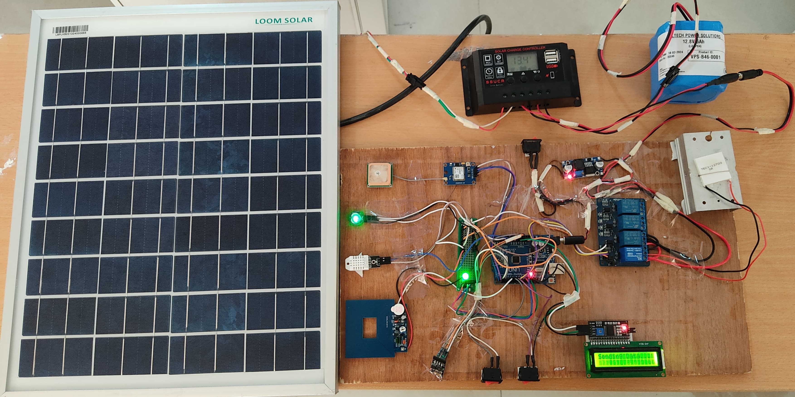

# Solar-Based E-Uniform for Soldiers

## Table of Contents

- Introduction
- Features
- Block Diagram
- Schematic Diagram
- Getting Started
- How to Use
- Results
- Advantages
- Future Scopes

## Introduction

The Solar-Based E-Uniform for Soldiers is a project designed to provide soldiers with a smart uniform equipped with various sensors and communication modules to enhance their safety and comfort during missions. This project integrates a range of components including environmental sensors, a GPS module, and wireless communication via Wi-Fi, enabling real-time monitoring and data transmission.

## Features

- Monitoring of environmental parameters (temperature, humidity)
- Detection of vital signs (heart rate)
- Metal detection capability
- GPS tracking for location monitoring
- Integration with Thingspeak for data visualization and analysis
- Peltier module for heating, cooling, and neutral modes to adjust inner temperature based on soldier's comfort

## Block Diagram

The block diagram illustrates the sophisticated electronic architecture of a solar-powered uniform tailored for soldiers. The system harnesses solar energy through a Solar Panel at the top, which is connected to a Charge Controller. The controller regulates the power flow to a Battery, ensuring safe charging and discharging cycles.

The stored energy in the battery is then distributed to various components of the uniform. A Buck Converter is used to step down the voltage to appropriate levels for certain devices. The heart of the system is an Arduino ATmega328p, which acts as the central processing unit, orchestrating the operation of the entire uniform.

Input devices include:

- Switches for manual control
- A Pulse Sensor to monitor the soldier’s vitals
- A DHT11 AT Sensor for atmospheric conditions
- An RGB LED for visual signaling
- A Metal Detector for field operations

Output devices managed by the Arduino include:

- Relays for controlling power to various modules
- An I2C connection for communication between devices
- A 16 x 2 LCD module for displaying information
- An ESP 8266 Module for wireless communication

This solar-based e-uniform integrates renewable energy and advanced electronics to enhance the capabilities and safety of soldiers in the field.

## Schematic Diagram

The schematic diagram details the electrical circuitry for the “Solar-Based E-Uniform for Soldiers.” It starts with a Solar Panel, which captures solar energy and directs it to a Charge Controller. The controller’s role is to regulate the charging process of the Battery, ensuring the battery is charged efficiently and safely.

The battery serves two critical functions in the circuit:

  1. It supplies 12V to a Peltier Module, which is utilized for temperature regulation within the uniform,
     providing cooling or heating as required.
  2. It also connects to a Buck Converter that steps down the voltage to 5V. This lower voltage is essential for
     powering the Arduino Uno, which acts as the central hub of the uniform’s electronic system.

Safety and control mechanisms are paramount, evident in the inclusion of Relays and Switches to protect and manage the electrical circuit. The diagram employs red lines to denote positive connections, black lines for negative connections, and green lines to represent communication lines essential for coordinating the system’s components.

This solar power management system forms the backbone of the e-uniform, providing a reliable and renewable energy source to power various electronic devices crucial for soldiers' operations.

## Getting Started

To replicate this project, you will need the following materials:

- Arduino ATmega328P
- ESP8266 Wi-Fi module
- NEO-6M GPS module
- DHT11 sensor (temperature and humidity)
- Pulse sensor
- Metal detector sensor
- Peltier module
- Relay modules (2)
- Switches (3)
- 12V solar panel
- Solar charge controller
- 12V lithium-ion battery
- Buck converter
- I2C 16x2 LCD
- RGB LED
- Heat sink
- Zero PCB
- Various resistors, capacitors, and wiring components

Additionally, you will need:

- Arduino IDE (Integrated Development Environment) for writing, compiling, and uploading code to the Arduino ATmega328P.
- ThingSpeak account for data logging and visualization. You can sign up for free at [ThingSpeak](https://thingspeak.com/).
- u-center2 software for configuring and testing the NEO-6M GPS module.

For detailed instructions on assembly and programming, please refer to the documentation provided in the repository.

## How to Use

1. Connect the components according to the provided schematic.
2. Upload the Arduino sketch to the ATmega328P.
3. Power on the system and ensure all modules are functioning properly.
4. Follow the usage instructions for individual components (e.g., switches, sensors).

## Results

The data collected from various sensors is transmitted to Thingspeak for visualization and analysis. Here are some sample results:

### Temperature:

### Humidity:

### Heart rate: 

### Metal detection:

### Peltier Modes of Operation:

### GPS location:

### Readings:

## Advantages

- **Enhanced Soldier Comfort**: The integration of a Peltier module allows for precise control of the inner temperature of the uniform, ensuring optimal comfort for soldiers in various environmental conditions.
- **Real-time Monitoring**: With sensors for environmental parameters, vital signs, and GPS tracking, the e-uniform provides real-time data to commanders, enabling better decision-making and situational awareness.
- **Renewable Energy Integration**: By harnessing solar power, the uniform reduces reliance on traditional energy sources, making it more sustainable and environmentally friendly.
- **Improved Safety**: The inclusion of a metal detector enhances soldier safety by providing early detection of potential threats in the field.

## Future Scope

- **Advanced Sensor Integration**: Explore the integration of additional sensors such as gas sensors for detecting hazardous substances, or motion sensors for enhanced situational awareness.
- **AI and Machine Learning Integration**: Implement AI algorithms to analyze sensor data and provide predictive insights, such as identifying patterns in environmental conditions or predicting equipment failures.
- **Enhanced Communication**: Integrate advanced communication systems, such as mesh networking or satellite communication, to improve connectivity and information sharing among soldiers.
- **Modular Design**: Design the uniform with a modular architecture to easily accommodate future upgrades and enhancements, allowing for scalability and adaptability to evolving needs.
- **Energy Harvesting**: Investigate the integration of additional energy harvesting technologies, such as kinetic energy harvesting from soldier movement, to further extend battery life and reduce reliance on external power sources.

